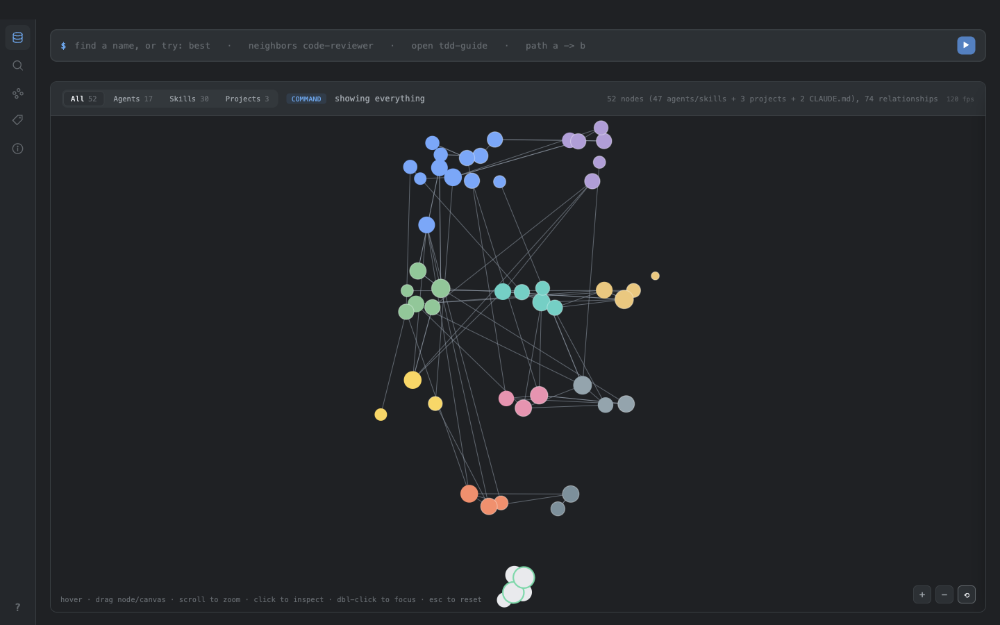
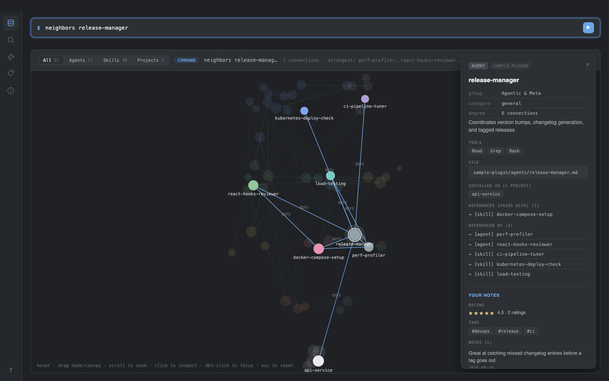

# Skill Graph

A Claude Code plugin that turns the skills and agents you already have into a graph you can
query — from a session, in your browser, or in a desktop app.

It catalogues every agent and skill in the folders you point it at, counts which of them actually
mention which others, scans your machine for projects that really have each one installed, and
exposes all of it as MCP tools. Everything it knows comes from reading real files.



Click any node for what references it, what it references, which projects have it installed,
and your own notes, ratings and tags:



## Install

```
/plugin marketplace add QuantumWars/project-graphx
/plugin install skill-graph
```

Then, in any project you want a graph for:

```
/skill-graph:setup     # say where your skills and agents live — then offers to build
/skill-graph:build     # rescan, whenever the sources change
/skill-graph:view      # look at it, in your browser
```

`/skill-graph:setup` asks before building rather than just doing it, because a build with
`scanRoots` set walks every scan root. Say yes and you go straight from nothing to a graph.

`/skill-graph:view` needs no download — it serves the viewer from `node`, which the plugin
already requires. `/skill-graph:app` opens the same viewer as a native desktop window
instead, at the cost of a one-time ~280 MB Electron install.

## Requirements

| For | You need | Notes |
| --- | --- | --- |
| The MCP tools | `node` 18+ | The server ships pre-bundled. No `npm install`. |
| `/skill-graph:build` | `python3` 3.6+ | Standard library only. On macOS this comes with the Xcode command line tools. |
| `/skill-graph:view` | nothing more | Same `node` as above. |
| `add_repo` | `git` | Only for importing an external repo's skills. |
| `/skill-graph:app` | `npm` + ~280 MB | One-time Electron install, on first launch only. Optional. |
| Running the tests | `bun` | Contributors only. |

**Windows is not supported for `/skill-graph:build`.** The build commands invoke `python3`,
which Windows Python installs do not usually provide (it is `python` or `py`). `install_skill`
has the same dependency and fails *after* copying files, so it can leave a half-applied
state. WSL works.

The desktop app's packaging script targets **macOS arm64 only**. On other platforms use
`/skill-graph:view`, or run it unpackaged with `npm start` from `app/`.

## Where things live

Code ships with the plugin. Data belongs to the project:

```
<your project>/.claude/graph/
├── config.json        what to catalogue, what to scan   (you own this — commit it)
├── graph-data.json    the built graph                   (regenerated wholesale)
├── overlay.json       your notes, ratings, tags, edges  (survives rebuilds)
└── imported-repos/    shallow clones from add_repo
```

No graph data is ever written into the plugin directory, which is wiped on every reinstall. Two
projects on the same machine get two independent graphs and never see each other's.

The one exception is Electron itself: `/skill-graph:app` installs it under the plugin's `app/`,
so a plugin update means downloading it again. `/skill-graph:view` has nothing to reinstall,
which is the main reason it is the default.

`graph-data.json` is rebuilt from scratch by every `/skill-graph:build`. Never edit it by hand —
your edit will vanish. Everything you add through the tools goes to `overlay.json`, which builds
never touch.

## Configuring

`.claude/graph/config.json`:

```json
{
  "sources": [
    { "repo": "my-project", "root": ".claude/agents", "kind": "agent" },
    { "repo": "my-project", "root": ".claude/skills", "kind": "skill" }
  ],
  "scanRoots": ["~/code"],
  "scanExclude": ["/node_modules/"]
}
```

- **sources** — directories holding the agents and skills to catalogue. `kind: "agent"` for a folder
  of `*.md`; `kind: "skill"` for a folder of `<name>/SKILL.md` directories. Relative paths resolve
  against the project root. A missing root is skipped with a warning, not a crash.
- **scanRoots** — trees searched for projects that have those skills installed. This is what fills
  in "who actually uses this". `[]` means scan nothing, and is honoured as written.
- **scanExclude** — drop any path containing one of these substrings.

A project that owns a configured source is never counted as a user of its own catalogue. Without
that, a repo cataloguing its own `.claude/skills` would report itself as a user of every skill in
it, and every usage number would be inflated by one.

## What the tools tell you, and what they don't

**Edges are counted mentions.** An edge exists because one file's text contains another node's name.
That is a real, reproducible measurement — it is not a curated statement that two things belong
together. A skill named after a common word collects edges by coincidence.

**Usage is a filesystem fact.** `usedBy` comes from checking whether the file is actually there.
Absent means "not found under your scan roots", never "unused".

**Categories are a guess.** They come from a keyword heuristic at build time, which reads the name
first and only falls back to the description when the name says nothing — a thing named
`python-testing` is Python, a thing that merely *mentions* Python in passing is not. It is still a
heuristic: it will file some things oddly and it says `general` when it cannot tell. Tags are
hand-applied and mean what someone decided. Prefer tags.

**Imported repos have no edges.** `add_repo` extracts frontmatter only; cross-references are not
computed for imports. Zero connections on an imported skill is a statement about the importer, not
about the skill. This is also why importing a directory you already configured as a source is worse
than useless, and why it is refused — see below.

## When two things share a name

Two unrelated repos may each hold a `code-reviewer`, and both belong in the graph. So a lookup by
name can be genuinely ambiguous, and the answer names the ids instead:

```json
{ "error": "ambiguous", "candidates": ["myproj:agent:code-reviewer", "import:other:agent:code-reviewer"] }
```

Every tool that takes a node also accepts an id, so a candidate from that list can be passed straight
back to resolve the tie — including `install_skill` and `uninstall_skill`, where picking the wrong one
copies or deletes real files.

**`add_repo` refuses a directory the build already catalogues.** Both routes would reach the same
files — the build writes them to `graph-data.json`, an import stores them in `overlay.json`, and the
two are merged at read time — so every item under it would appear twice under one name, and no id
could tell them apart because they *are* the same file. It stops before writing anything, naming the
file that is already in the graph and ending "Nothing was imported."

Two different repos that happen to share a skill name are fine and still import; the check is on
paths, not names.

## The graph is a snapshot

It reflects the last build. Add a skill by hand, change a source, or install something outside these
tools, and it is stale until you build again. `install_skill` and `uninstall_skill` re-scan
themselves; nothing else does.

## Development

```bash
bun install --frozen-lockfile   # exactly the versions CI and the bundle were built from
bun test                        # unit + end-to-end
bun run bundle                  # rebuild server/server.bundle.mjs after editing server/
```

`bun.lock` pins what the committed bundle is compiled from, and `app/package-lock.json` pins the
Electron the desktop app was tested against. CI installs with `--frozen-lockfile`, so a dependency
bumped without updating the lockfile fails the run instead of quietly shipping.

The viewer can be run directly, which is the fastest way to iterate on `app/`:

```bash
node server/viewer-server.js --data-dir <project>/.claude/graph
```

**Re-bundle after any change under `server/`.** `.mcp.json` runs the bundle, not the source, so an
un-bundled edit is an edit that does not ship. The end-to-end suite launches the bundle exactly as
Claude Code does and will fail if it is stale, and CI rebuilds it and fails if the committed copy
differs.

`bun run bundle` also runs `scripts/normalize-bundle.js`, which replaces the `__dirname` literal the
bundler freezes in at build time with a runtime expression. Without it the artifact would carry the
absolute path of whoever built it, and two machines would never produce the same bytes — which is
what makes the CI comparison possible at all.

## Licence

MIT — see [LICENSE](LICENSE).
